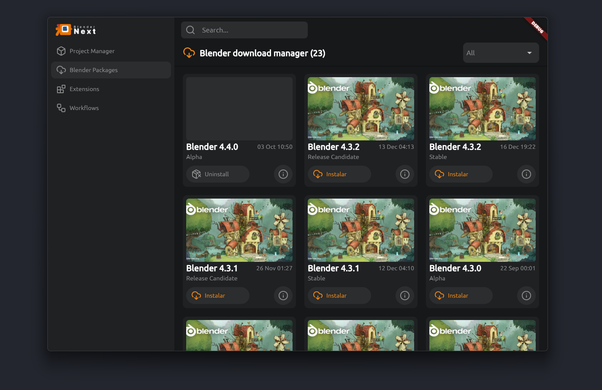

# Blender Next

> This project is still under development

Checkout our youtube cahnnel and discord for more updates and download link

| Discrod                                       | Youtube                                                 |
| --------------------------------------------- | ------------------------------------------------------- |
| [Discord Server](https://discord.gg/JUrSyXD7) | [Youtube channel](https://www.youtube.com/@blendernext) |

Blender Next is a free and open-source desktop application built with Flutter,
focusing on Windows users. It streamlines Blender workflows by integrating
project management, command-line execution for automated tasks, and version
control with GitHub. This app is designed to enhance productivity for Blender
users by automating routine tasks and managing Blender versions effectively.

---

## Key Features

### 1. **Command-Line Integration with Blender**

Blender Next enables users to execute Blender tasks via the app UI without
launching the Blender or writing any script. This feature supports automation,
batch processing, and improved flexibility for both individual and team
workflows.

#### Highlights:

- **Background Rendering**: Execute rendering tasks in the background directly
  from the app.
- **Render Jobs Management**: Queue, prioritize, and monitor multiple render
  tasks.
- **Batch Processing**: Automate sequences like remeshing, baking, and
  exporting.
- **Task Queuing**: Set up a sequence of operations (e.g., remeshing followed by
  rendering and exporting).
- **Script Execution**: Run custom Python scripts to extend Blender’s
  functionality.
- **Real-Time Status Feedback**: Track task progress, success, or failure in
  real-time.
- **Customizable Arguments**: Pass specific command-line arguments for tailored
  Blender operations.
- **Log Outputs**: View detailed logs for each task, aiding in debugging and
  performance tracking.

### 2. **Blender Version Download Manager**

Simplify managing multiple versions of Blender to ensure compatibility across
projects and teams.

### 2. **Extensions/Addons managent**

Migrate your addons and check compatibility on each blender version.

#### Highlights:

- **Browse and Download**: Access stable and experimental Blender versions
  directly through the app.
- **Install and Switch Versions**: Seamlessly switch between installed versions
  for different projects.
- **Auto-Update**: Get notified about new Blender releases and update with one
  click.

- **Backup and Rollback**: Create backups before updates and roll back to
  previous versions when needed.

#### Example Use Cases:

- **Version Switching**: Easily switch from Blender 3.0 to 2.93 for legacy
  project compatibility.
- **Version History**: Maintain a record of which versions were used for
  specific projects.

### 3. **GitHub Integration**

Ensure seamless version control for your Blender projects with GitHub
integration:

- **Commit and Push Changes**: Manage project changes directly from the app.
- **Track File Versions**: Easily navigate project history and revert changes.

---

## Architecture Overview

### App Server (Standalone Tool)

- **Backend**: Manages command-line interactions, task queues, Blender
  downloads, and monitoring.
- **Frontend**: Provides an intuitive UI for managing tasks, logs, and project
  settings.
- **Task Scheduler**: Handles background tasks like rendering and remeshing.

### Blender Client Extension

- **Python Scripts**: Extend Blender functionality to interact with the app via
  HTTP or WebSockets.
- **Command-Line Interface**: Enables the app to call the Blender for tasks like
  rendering or batch processing.

### Communication Mechanism

- **WebSockets/REST API**: Ensure smooth data exchange between the app and
  Blender.
- **File System Monitoring**: Optionally monitor directories for new projects to
  automate task setup.

---

## Getting Started

### Prerequisites

- Windows OS
- Git installed (optional for GitHub integration)

### Installation

1. Download the latest release from the
   [Releases](https://github.com/luk3d/blender_next/releases) page.
2. Install the app and follow the setup instructions.
3. (Optional) Configure GitHub integration by linking your account in the app
   settings.

### Usage

1. Launch the app.
2. Create a new Blender project.
3. Set up tasks (e.g., rendering, remeshing) or manage your Blender versions.

---

## Future Plans

- **Enhanced Security**: Implement user permissions for team environments.
- **Gallery**: Integrate more workflows and community gallery.

---

## Contributing

We welcome contributions! Please check the
[Contributing Guidelines](https://github.com/luk3d/blender_next/blob/main/CONTRIBUTING.md)
for details.

---

## License

This project is licensed under the MIT License. See the
[LICENSE](https://github.com/luk3d/blender_next/blob/main/LICENSE) file for
details.

---

## Contact

For questions or suggestions, feel free to open an issue or reach out via email
at [filipelukebana@gmail.com].
